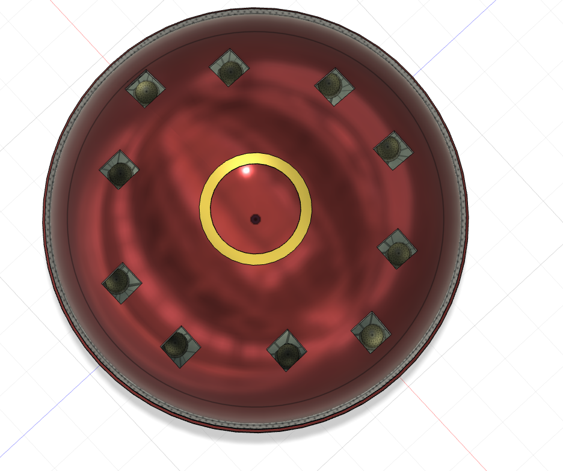
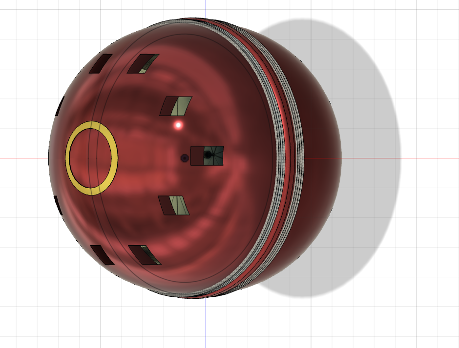
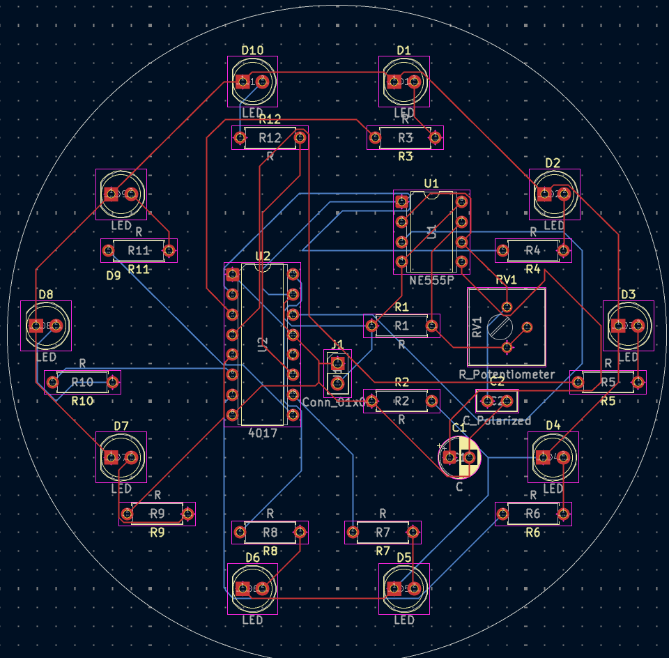
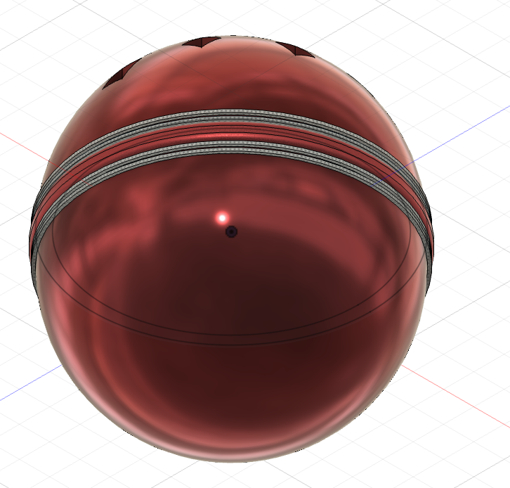
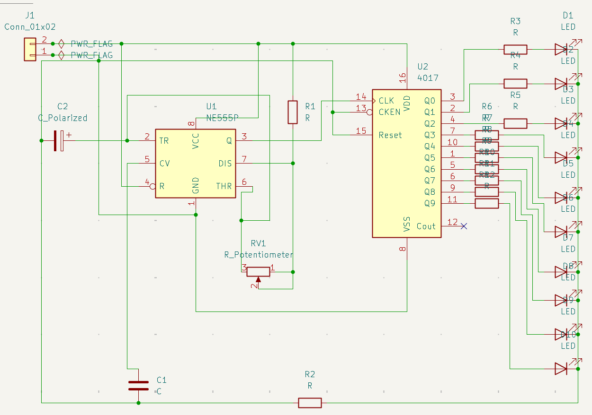

# shauryachaser LED Chaser

a cricket-ball themed LED chaser because why not  
hardware-only, no firmware needed — powered by a 555 + CD4017  
and mounted inside a shiny 3D-printed cricket ball enclosure

## What is this

Basically I wanted to make something fun, weird, and actually functional.  
So I built an LED chaser circuit (classic 555 + CD4017) and wrapped it inside  
a custom Fusion 360 modeled cricket ball enclosure with seam lines, stitching, and a full LED ring.

## Hardware

- **Logic**: NE555P (clock) + CD4017BE (decade counter)
- **LEDs**: 10x 5mm diffused LEDs arranged around the ball
- **Resistors**: 10x LED current limiters + timing resistors
- **Potentiometer**: 50k trim pot for speed control
- **Caps**: 1uF electrolytic + 0.01uF ceramic
- **Power**: Standard 5V input (2-pin header)
- **Enclosure**: 93mm diameter 3D-printed cricket ball with stitched seam

## How it works

- The **555 timer** generates a square wave clock (rate set by RV1).
- Every clock pulse goes into the **CD4017**, which advances to the next output: Q0 → Q1 → Q2 → ... → Q9 → loops back
- Each Q output drives an LED through a 470Ω resistor.
- Result = lights chase around the seam like a rotating/bouncing cricket ball.

You rotate RV1 to speed up or slow down the chase.

## BOM

**ICs**
- 1x NE555P (DIP-8)
- 1x CD4017BE (DIP-16)

**LEDs**
- 10x 5mm LEDs (any color)

**Resistors**
- 10x 470Ω (LEDs)
- 2x 1kΩ (timing)

**Potentiometer**
- 1x 50kΩ trim pot (3386P style)

**Capacitors**
- 1x 1uF electrolytic
- 1x 0.01uF ceramic

**Connectors**
- 1x 2-pin 2.54mm power header

**PCB**
- 1x Circular 93mm custom PCB (KiCad)

**Case**
- ~70–100g PLA (for the cricket ball halves)
- 4x M3x16 screws (optional if mounting)
- 4x M3 heatset inserts (optional)

## Estimated Prices

(approx retail), see BOM.csv

- LEDs: ~$1.00 for all 10  
- Resistors: ~$0.60  
- NE555P: ~$0.40  
- CD4017BE: ~$0.70  
- Potentiometer: ~$0.50  
- Capacitors: ~$0.25  
- Header: ~$0.10  
- PCB: ~$15 (JLCPCB)  
- PLA: ~$1 worth  
**Total:** ~**$20** all-in

## Building one

- `/ledcha` — KiCad PCB + schematic
- `/cad` — 3D Fusion 360 files for the cricket enclosure
- `/assets` — top/side/bottom views, schema and pcb
Steps:

1. Export Gerbers → order PCB from JLCPCB/Seeed/etc.
2. 3D print the cricket ball halves.
3. Solder the PCB: ICs, resistors, LEDs, pot, caps.
4. Insert the PCB inside the enclosure.
5. Power with 5V.
6. Rotate the pot to change chase speed.